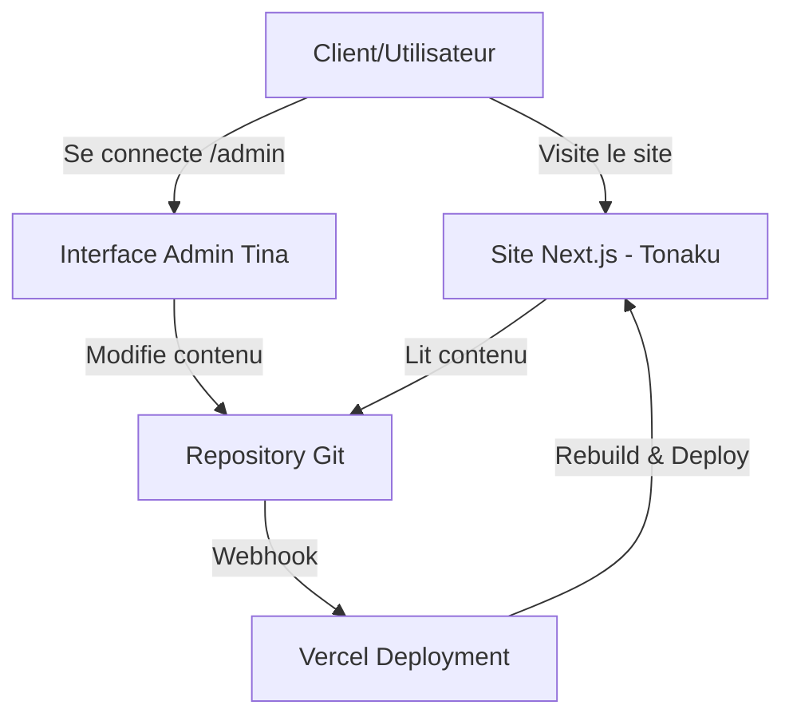
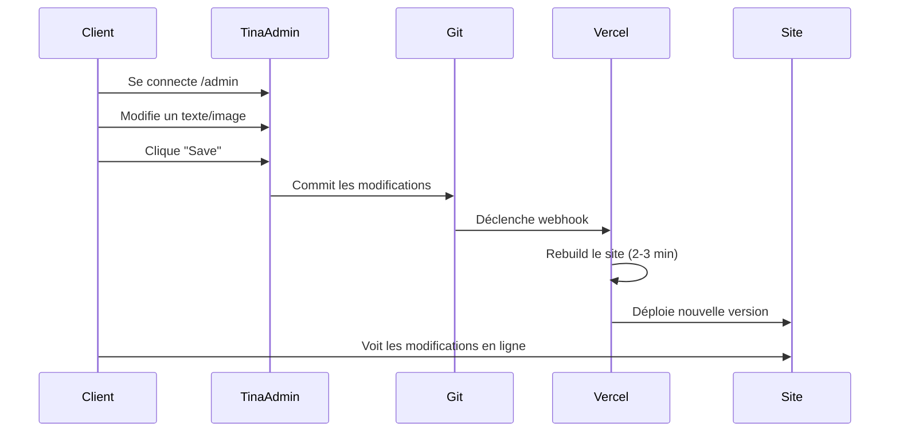

# Projet Tonaku - Plan d'Action

## Vue d'ensemble

Site web monopage pour l'association **Tonaku**, avec système de gestion de contenu (CMS) permettant au client de modifier facilement textes et images sans coûts d'hébergement supplémentaires. Le contenu sera stocké dans Git et déployé automatiquement sur Vercel.

---

## Architecture Recommandée

### Pourquoi Tina CMS ?

✅ **Complètement gratuit** - Aucun coût d'hébergement  
✅ **Stockage dans Git** - Le contenu est stocké directement dans votre repository (fichiers Markdown/JSON)  
✅ **Interface visuelle intuitive** - Parfait pour un utilisateur débutant  
✅ **Édition en temps réel** - Le client voit ses modifications instantanément  
✅ **Intégration Next.js native** - Conçu spécifiquement pour Next.js  
✅ **Déploiement automatique** - Chaque modification déclenche un rebuild Vercel  
✅ **Gestion d'images** - Support natif avec stockage dans le repository  

### Pourquoi pas un système Git manuel ?

❌ Complexité technique élevée  
❌ Risques de conflits Git  
❌ Gestion des tokens d'authentification délicate  
❌ Interface difficile à rendre intuitive  
❌ Maintenance importante  

---

## Architecture du Projet



---

## Structure du Projet

```
client-producte/
├── app/                          # App Router Next.js 14+
│   ├── page.tsx                 # Page d'accueil monopage Tonaku
│   ├── layout.tsx               # Layout principal
│   └── admin/                   # Routes admin Tina
├── components/                   # Composants React
│   ├── Hero.tsx                 # Section héro
│   ├── About.tsx                # À propos de l'association
│   ├── Activities.tsx           # Activités
│   ├── Team.tsx                 # Équipe/Membres
│   ├── Contact.tsx              # Formulaire de contact
│   └── Footer.tsx               # Pied de page
├── content/                      # Contenu éditable (géré par Tina)
│   ├── pages/
│   │   └── home.md              # Contenu de la page d'accueil
│   ├── activities/              # Articles sur les activités
│   └── team/                    # Membres de l'équipe
├── public/
│   └── uploads/                 # Images uploadées via Tina
├── tina/
│   ├── config.ts                # Configuration Tina CMS
│   └── schema.ts                # Schéma du contenu
├── .cursor/
│   └── plans/                   # Plans et documentation du projet
├── tailwind.config.js
├── next.config.js
└── package.json
```

---

## Étapes d'Implémentation

### ✅ 1. Initialisation du Projet Next.js
- [x] Créer un nouveau projet Next.js 14+ avec App Router
- [x] Configurer Tailwind CSS
- [x] Configurer TypeScript
- [x] Installer pnpm comme gestionnaire de packages

### ✅ 2. Installation de Tina CMS
- [x] Installer les dépendances Tina (`tinacms`, `@tinacms/cli`)

### 🔄 3. Configuration de Tina CMS
- [ ] Initialiser la configuration Tina
- [ ] Créer le schéma de contenu
- [ ] Définir les collections (pages, activités, équipe)
- [ ] Configurer le stockage des images dans le repository

### 🔄 4. Création du Schema de Contenu

Définir les champs éditables :

**Page d'accueil**
- Titre et slogan de l'association
- Description mission
- Image héro
- Sections à propos

**Activités**
- Titre de l'activité
- Description complète
- Images (galerie)
- Date de publication

**Équipe**
- Nom du membre
- Rôle/fonction
- Photo de profil
- Biographie courte

**Contact**
- Email de contact
- Téléphone
- Adresse physique
- Liens réseaux sociaux

### 🔄 5. Développement des Composants React

- [ ] Créer composant Hero avec image et slogan
- [ ] Créer composant About (mission de l'association)
- [ ] Créer composant Activities (grille d'activités)
- [ ] Créer composant Team (membres de l'équipe)
- [ ] Créer composant Contact (formulaire et informations)
- [ ] Créer composant Footer (liens et mentions légales)
- [ ] Appliquer Tailwind pour un design moderne et responsive

### 🔄 6. Intégration Tina CMS et Composants

- [ ] Connecter les composants aux données Tina
- [ ] Configurer les routes admin (`/admin`)
- [ ] Configurer l'authentification GitHub OAuth
- [ ] Tester l'édition en temps réel

### 🔄 7. Déploiement sur Vercel

- [ ] Créer un repository GitHub pour le projet
- [ ] Connecter le repository à Vercel
- [ ] Configurer les variables d'environnement pour Tina
- [ ] Configurer les webhooks pour rebuild automatique
- [ ] Tester le workflow complet de modification de contenu

### 🔄 8. Documentation pour le Client

- [ ] Créer un guide simple pour se connecter à l'admin
- [ ] Documenter comment modifier chaque type de contenu
- [ ] Créer des captures d'écran de l'interface admin
- [ ] Expliquer le processus de publication (commit + rebuild)

---

## Technologies Utilisées

| Technologie | Usage | Version |
|-------------|-------|---------|
| **Next.js** | Framework React (App Router) | 16.1.1 |
| **React** | Bibliothèque UI | 19.2.3 |
| **Tailwind CSS** | Framework CSS utility-first | 4.1.18 |
| **TypeScript** | Typage statique | 5.9.3 |
| **Tina CMS** | Gestion de contenu | 3.2.0 |
| **pnpm** | Gestionnaire de packages | 10.18.2 |
| **Vercel** | Hébergement et déploiement | - |
| **GitHub** | Repository et authentification | - |

---

## Coûts

### Total : 0€/mois 🎉

- **Vercel** (Hobby Plan) : Gratuit
- **Tina CMS** : Gratuit (self-hosted)
- **GitHub** : Gratuit (repository public ou privé)
- **Domaine personnalisé** : Optionnel (~10-15€/an)

---

## Workflow de Modification de Contenu



---

## Avantages de cette Solution

1. **Gratuit** - Aucun coût récurrent
2. **Simple** - Interface visuelle pour le client débutant
3. **Sécurisé** - Pas de base de données à sécuriser
4. **Versionné** - Historique complet dans Git
5. **Performant** - Site statique ultra-rapide
6. **Scalable** - Peut gérer une croissance future
7. **SEO-friendly** - Next.js optimisé pour le référencement
8. **Maintenance minimale** - Pas de serveur à gérer

---

## Notes Techniques

### Mises à jour mensuelles
Le client prévoit de mettre à jour le contenu environ une fois par mois. Le workflow Tina + Vercel est parfaitement adapté à cette fréquence.

### Gestion des images
Les images seront stockées dans `/public/uploads/` et versionnées avec Git. Pour un usage plus intensif, on pourrait migrer vers Cloudinary (gratuit jusqu'à 25 GB).

### Alternatives considérées

**Decap CMS** (ex-Netlify CMS)
- Interface plus classique (moins moderne)
- Configuration via fichier YAML
- Support des images via Git ou services externes
- Authentification GitHub

**Conclusion** : Tina CMS est recommandé pour sa modernité et son intégration Next.js supérieure.

---

## Prochaines Étapes

1. ✅ **Setup initial** - Projet Next.js + Tina CMS installés
2. 🔄 **Configuration Tina** - Initialiser et configurer le schéma
3. 🔄 **Développement** - Créer les composants et le design
4. 🔄 **Intégration** - Connecter Tina aux composants
5. 🔄 **Déploiement** - Mettre en ligne sur Vercel
6. 🔄 **Documentation** - Guide utilisateur pour le client

---

**Projet : Tonaku**  
**Date de création du plan** : 10 janvier 2026  
**Gestionnaire de packages** : pnpm  
**Hébergement** : Vercel (gratuit)  
